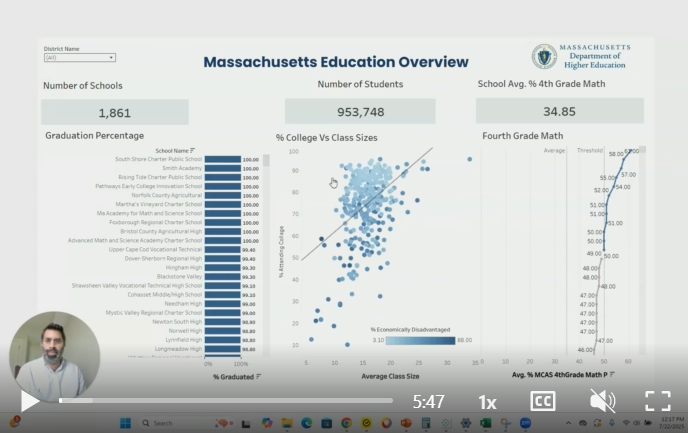
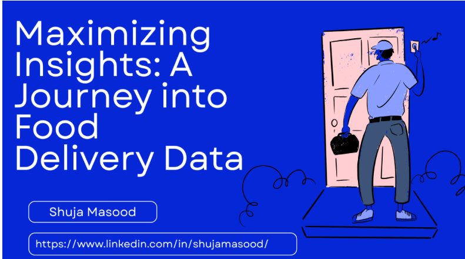

# Welcome to My Data AnalyticsPortfolio
---
### Learn About My Projects

#### [External Link Project](https://www.linkedin.com/pulse/r-hr-understanding-how-statistics-can-used-analytics-shuja-masood-qj4nc/)

Using an IBM-created HR dataset in RStudio, I explored:

🔎 Which employee attributes influence turnover

📊 How statistical models reveal hidden patterns

✅ Actionable insights to help HR retain younger talent

---
#### [External Link Project](https://www.linkedin.com/pulse/unearthing-insights-python-data-journey-iron-ore-shuja-masood-dzupc/)

🏭 I explored how Python can unlock insights from manufacturing data. Here’s what I tackled:

⌨️ Loading and profiling large CSV datasets in Python

🐼 Cleaning and organizing data using Pandas

📊 Visualizing trends and analyzing correlation data

---
#### [External Link Project](https://www.linkedin.com/pulse/nba-24-25-insights-future-game-shuja-masood-9g0mc/?trackingId=XtsVWFEXQ5WFO%2BGSShOi1w%3D%3D/)

I took a shot at breaking down last season’s NBA stats + the current free agent market using Tableau. 🏀📊
 
Highlights from my dashboard:
 
 🎯 Which teams launch the most three pointers—and who’s taking them.
 
 🏆 Last season’s top all-around stars.
 
 💰 Free agent market insights.
 
 💯 Team scoring trends & future sustainability.
 
 📊 + 📹 See the full Tableau dashboard + my video breakdown in the article 

---
#### [External Link Project](https://www.linkedin.com/pulse/insights-from-sql-how-data-analytics-can-enhance-hospital-masood-iqxrc/?trackingId=%2B9oxR2GkoK606PgGQXzBLA%3D%3D/)

Using real patient data from Kaggle, I hope this article will help walk you through how we can use SQL to:

🏥 Build a histogram to show the distribution of patient visit lengths.

🧪 Use CASE statements to assess whether lab procedures impact hospital visit length.

📊 Join two tables to understand if race influences number of lab procedures.

💊 Leverage CTEs and RANK functions to understand what diabetic medicine is used the most by age group.

---
#### [External Link Project](https://www.linkedin.com/pulse/understanding-world-banks-international-development-journey-masood-gxpjc/?trackingId=5cIDEpPHxptzbQocQ6AwQQ%3D%3D/)

This SQL project analyzes World Bank's IDA data from 2022 through June 2025. 

Key insights:

 🧽 The data is a little messy with duplicate data. The article discusses how we navigate these dynamics and create cleaner datasets.
 
 💲 Projects with active loans increased over the years
 
 ⚠️ The Ukraine conflict spurred greater IDA funding needs
 
 ✅ 2,242 projects were either paid off or received credit

---
#### [External Link Project](https://www.loom.com/share/45d982252c07467587b3277e4209a0a6/)

In this case study, I'm analyzing high school data to help the Massachusetts Department of Higher Education understand the health of their 1,800+ high schools and profile close to a million students that attend them. 

---
#### [External Link Project](https://www.linkedin.com/pulse/maximizing-insights-journey-food-delivery-data-shuja-masood-zrlpf/)
)

In this exercise, I'm using the power of Excel to analyze a data set of customers using a digital food delivery platform. Hey DoorDash, UberEat you may find this useful! 

